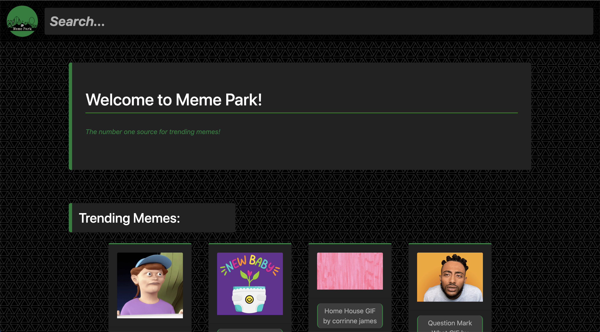
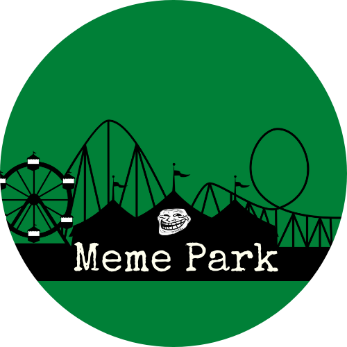

# Meme Park

## Purpose

A fun and dynamic web app to find trending memes!

## Status

This is a completed project for the Wyncode midterm assignment.

## Screenshots

## Why Memes?

During these times of pandemic, we want to offer a fun website where everyone can go for a quick laugh. Memes are used daily to enhance our conversations online by providing something lighthearted that everyone can relate to and easily understand.

## Who

We are a group of four Wyncode students who wanted to use this opportunity to share our love of memes and bring some positivity to the world. Thanks to the GIPHY Developer API, we were able to achieve this goal.

A little more about us:

**Liz W.:** Full Stack Web Development student from Wyncode's Cohort 38. Currently enjoying the journey of transitioning my career from retail management to web developer!

**Erialbania L.:** Full Stack Web Development student from Wyncode's Cohort 38. Former digital marketing coordinator looking to make a career change into the tech industry.

**Andrew G.:** Full Stack Web Development student from Wyncode's Cohort 38. Freelance musician/producer with HR management experience. Looking to transition into the tech industry as well as implement programming to my professional endeavours.

**Rodolfo R.:** Full Stack Web Development student from Wyncode’s 38. Former Head Chef looking for a new path in my career into the world of Bug Bunts.

## How

#### Dependencies

In order to set up this project, you will need to set up by running the following commands:

    git clone repo
    yarn install
    cd client && yarn install
    cd .. && yarn dev

Before you run the project, be sure to add your own GIPHY API Key. You can sign up for one at [https://developers.giphy.com/](https://developers.giphy.com/)

The project uses the following dependencies:

1.  React Bootstrap
2.  React Router
3.  React Router Dom
4.  React Share
5.  React Scripts
6.  Axios
7.  Concurrently
8.  Express

#### Deploy

Our project is deployed at [https://meme-park.herokuapp.com/](https://meme-park.herokuapp.com/)

